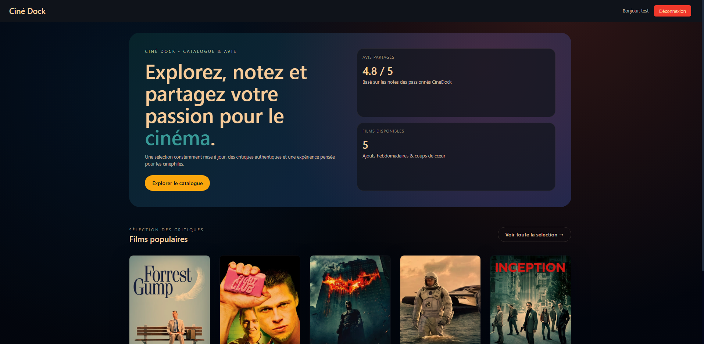
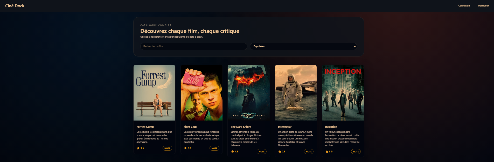
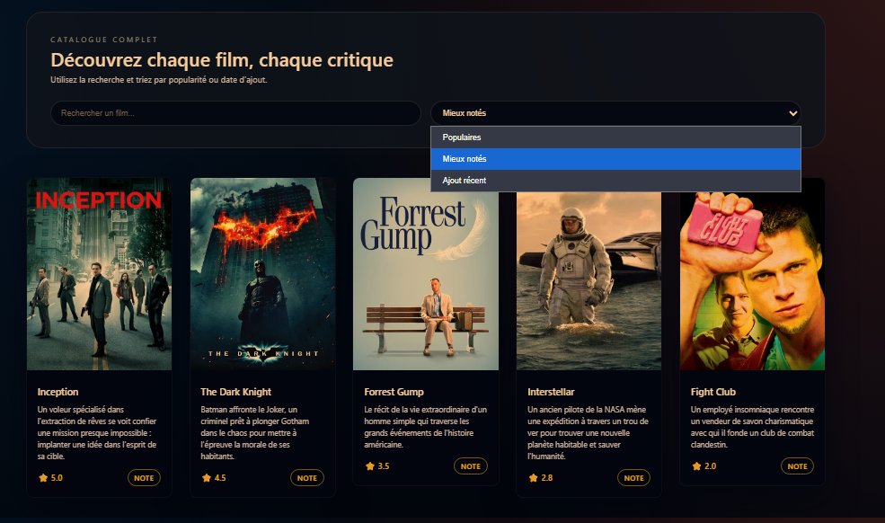
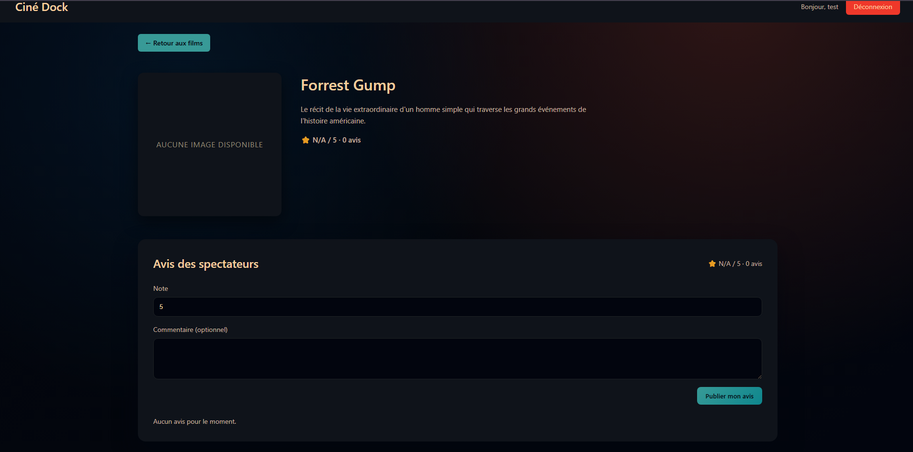
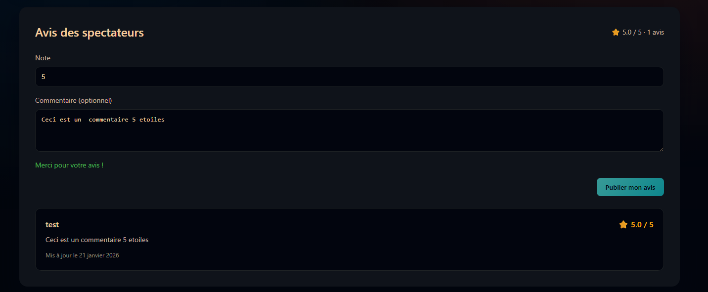
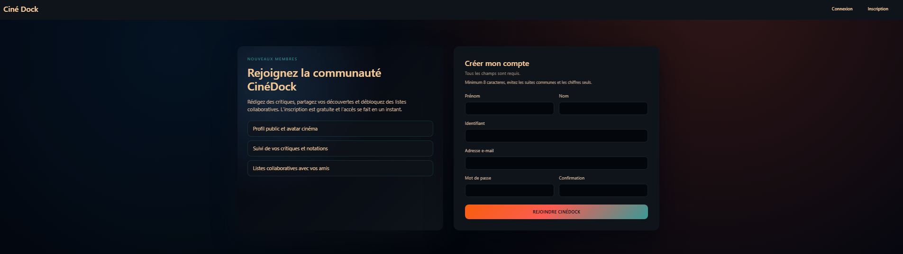
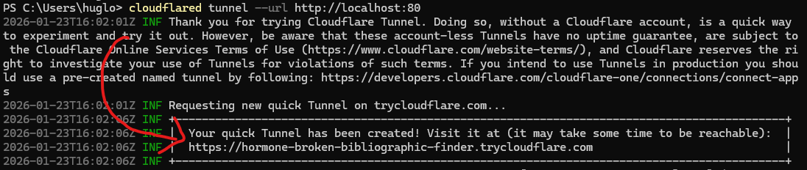
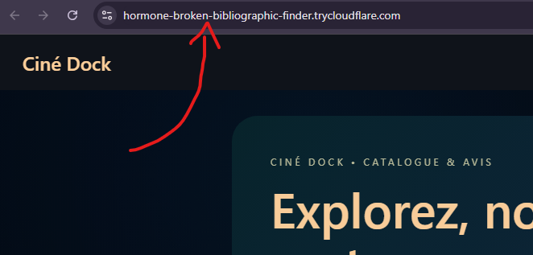

# CineDock

> **⚠️ MEMBRES DU GROUPE :**
> - **RAGUIN Hugo** 
> - **TALEB Amine** 

---

## 1. Présentation du Projet
CineDock est une stack full‑Docker qui combine une API Django REST, un frontend React/Vite et un reverse proxy Caddy pour proposer un catalogue de films collaboratif. Les utilisateurs parcourent les sorties récentes, consultent des fiches détaillées et contribuent aux critiques grâce à une authentification par jeton. L’objectif est double : fournir une démo DevOps prête à déployer (infra, proxy, images dédiées) et illustrer un flux complet d’application web orientée contenu.

**Fonctionnalités principales :**
* Catalogue de films enrichi avec Images, descriptions et métriques calculées (note moyenne, nombre d’avis).
* Recherche plein texte et tri dynamique (popularité, meilleure note, ajouts récents) côté frontend pour explorer rapidement la base.
* Authentification et inscription sécurisées (DRF Token), persistance locale du jeton et gestion de session dans le navigateur.
* Espace critique communautaire : chaque membre peut noter/commenter un film, mettre à jour sa fiche et modifier son avis à tout moment.


**Screenshot de l'application déployée** : 







## 2. Architecture Technique

### Schéma d'infrastructure
Le diagramme PlantUML décrit l’enchaînement complet des containers : un tunnel Cloudflare Zero Trust (cloudflared) termine les connexions publiques avant de les transmettre à Caddy, qui route ensuite vers le frontend Vite ou le backend Django/DRF, lesquels dialoguent avec PostgreSQL. Les volumes persistants (Caddy, base de données) et le réseau bridge `cinedock-network` sont explicitement modélisés.


### Description des composants
- **Cloudflare Tunnel (cloudflared)** : sécurise l’exposition publique via un tunnel Zero Trust géré par Cloudflare et forward les requêtes HTTPS vers le service Caddy sans ouvrir les ports 80/443 de l’hôte.
- **Caddy (reverse proxy)** : termine TLS (certificats auto gérés) et route `/` vers le frontend React, `/api` vers Django. Les données de config/certifs sont conservées dans `caddy_data` et `caddy_config`.
- **Frontend (React + Vite)** : conteneur Node 20 Alpine servant l’interface SPA sur le port interne 5173 ; il communique avec l’API via `VITE_API_URL` et reste derrière Caddy.
- **Backend (Django REST + Gunicorn)** : image Python 3.12 multi-étapes. Au démarrage, la commande applique les migrations et exécute les seeders `seed_movies` et `seed_users` avant de lancer Gunicorn sur 8000.
- **Base de données (PostgreSQL 16)** : stocke les films, utilisateurs et critiques. Le volume nommé `pgdata` garantit la persistance. Un healthcheck `pg_isready` synchronise le démarrage du backend.
- **Redis (cache applicatif)** : centralise le cache Django (sessions, listes de films) pour soulager Postgres et accélérer les pages les plus consultées. Les clés sont préfixées `cinedock` afin d'éviter les collisions.
- **Réseau & secrets** : tous les services (hors volumes) partagent `cinedock-network`. Les variables sensibles (`POSTGRES_*`, `DJANGO_SECRET_KEY`, `DATABASE_URL`, `REDIS_URL`) sont centralisées dans `.env` et injectées via `env_file` pour éviter les valeurs codées en dur.

### Description des services
| Service | Image Docker | Rôle | Port Interne |
| :--- | :--- | :--- | :--- |
| **Cloudflare Tunnel** | `cloudflare/cloudflared:latest` | Maintient un tunnel Cloudflare Zero Trust et forward 443 -> Caddy (port 80 interne) | Virtuel |
| **Caddy (proxy)** | image custom basée sur `caddy:2` (cf. `caddy/Dockerfile`) | Termine TLS, sert les assets statiques et reverse-proxy `/` → frontend, `/api` → backend | 80 / 443 |
| **Frontend React** | image custom basée sur `node:20-alpine` | SPA Vite, consomme l’API, expose le port dev 5173 (derrière Caddy en prod) | 5173 |
| **Backend Django** | image custom basée sur `python:3.12-slim` | API REST + tâches seed/migrations, servie par Gunicorn | 8000 |
| **PostgreSQL** | `postgres:16-alpine` | Base de données relationnelle persistée dans `pgdata` | 5432 |
| **Redis** | `redis:7-alpine` | Cache partagé pour les sessions et les réponses fréquemment demandées | 6379 |


## 3. Guide d'installation

Pour lancer le projet localement :

1.  Cloner le dépôt :
    ```bash
    git clone https://github.com/theohugo/CineDock.git
    cd CineDock
    ```

2.  Préparer les variables d’environnement :
    ```bash
    cp .env.example .env
    ```
    Renseignez `POSTGRES_*`, `DJANGO_SECRET_KEY`, `DATABASE_URL`, `REDIS_URL`, `VITE_API_URL`, etc. (voir `docker-compose.yml`). Sous Windows PowerShell : `Copy-Item .env.example .env`.

3.  Construire les images (optionnel mais recommandé en local) :
    ```bash
    docker compose build
    ```

4.  Démarrer la stack :
    ```bash
    docker compose up -d
    ```

5.  Exposer l’instance via Cloudflare Tunnel :
    ```bash
    cloudflared tunnel --url http://localhost:80
    ```
    Cette commande établit un tunnel Zero Trust temporaire vers votre instance locale et fournit l’URL publique affichée par `cloudflared`. 




6.  Vérifier les services :
    * Frontend : http://localhost
    * API healthcheck : http://localhost/api/health/
    * Docs REDOC  : http://localhost/api/redoc/

7.  Suivre les logs en cas de besoin :
    ```bash
    docker compose logs -f backend
    ```

## 4. Méthodologie & Transparence IA

### Organisation
Répartition claire : Hugo a pris le backend (Django, seeders, orchestration Docker, écriture du ReadMe, Refonte graphique du Frontend) tandis qu’Amine pilotait tout le frontend (React/Vite, UX) ainsi que la configuration Cloudflare Tunnel et Caddy. Nous avons travaillé en pair-programming ponctuel via appels Discord pour débloquer les points complexes et garder une vision commune.

### Utilisation de l'IA (Copilot, ChatGPT, Cursor...)
* **Outils utilisés :** GitHub Copilot, ChatGPT GPT-5.1 (mode Codex)
* **Usage :**
    * *Génération de code :* Copilot a proposé le squelette du `docker-compose.yml` et des composants React (forms de login, MovieCard) que nous avons ensuite adaptés.
    * *Débuggage :* ChatGPT GPT-5.1 nous a aidés à corriger une mauvaise configuration Caddy (route `/api`) et à comprendre l’erreur de token DRF lors de la seed.
    * *Documentation :* GPT-5.1 a servi à structurer les sections de ce README (présentation, architecture, méthodo) pendant que nous validions chaque élément.
* **Apprentissage :** Nous avons systématiquement repris les suggestions IA pour les reformuler ou les tester. Cela nous a permis de vérifier la configuration réseau Docker, de comprendre comment DRF Spectacular expose Swagger/Redoc et de retenir les bonnes pratiques de seed custom dans Django.

## 5. Difficultés rencontrées & Solutions
* *Problème 1 :* La route d’authentification `/api/auth/login/` renvoyait systématiquement une erreur car les tokens DRF n’étaient pas générés en local. Pourtant, le Dockerfile backend lance bien `manage.py seed_users` au démarrage.
* *Solution :* Forcer manuellement, lors du premier run, `python manage.py migrate` puis `python manage.py seed_users` dans le conteneur backend afin d’aligner l’état local avec l’entrypoint. Ensuite, les seeders automatiques suffisent et l’authentification fonctionne.

* *Problème 2 :* En lançant frontend et backend intégralement dans Docker, nous perdions le hot reload côté React.
* *Solution :* Nous avons conservé le backend (Django + Postgres + Caddy) dans Docker mais lancé le frontend localement via `npm install && npm run dev` pendant la phase de développement uniquement. Ainsi, on garde l’accès API via Caddy tout en profitant du hot reload Vite, tandis qu’en production le frontend reste conteneurisé.
